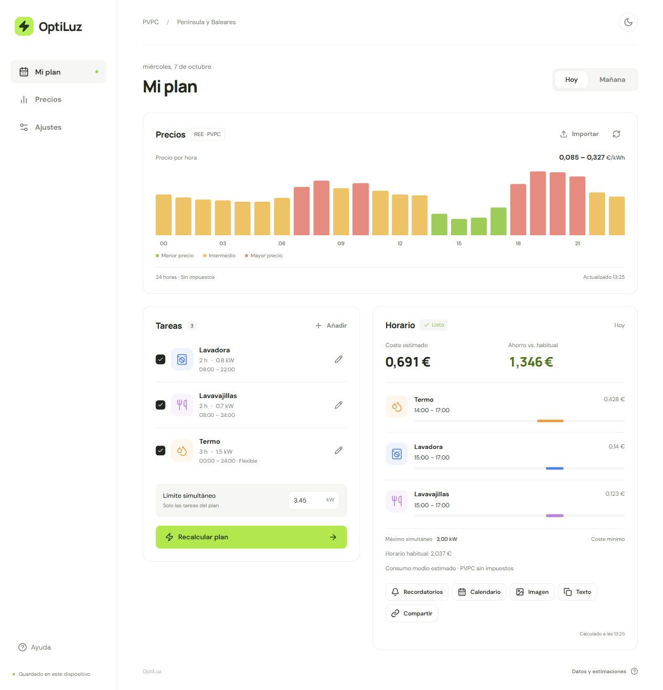
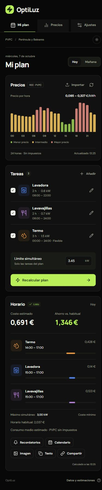

# OptiLuz

Planificador doméstico para organizar varias tareas con precios PVPC o tarifas horarias. Introduce tus electrodomésticos, sus horarios y un límite de potencia; OptiLuz calcula un plan conjunto y su coste estimado.

Es una aplicación web instalable (PWA), con modos claro y oscuro y datos guardados en tu dispositivo.

## Funcionalidades

- **Hoy y mañana:** consulta los precios oficiales de Red Eléctrica o importa los de tu tarifa.
- **Hasta cinco tareas:** plantillas de lavadora, lavavajillas, termo, secadora y carga del coche, con valores editables.
- **Horarios personalizados:** duración, potencia o energía del ciclo, ventana disponible, hora límite e inicio habitual.
- **Plan conjunto:** respeta la potencia simultánea y la continuidad de cada ciclo; permite dividir las tareas que admiten interrupciones.
- **Comparación de costes:** muestra el coste del plan y la diferencia respecto al horario habitual.
- **Compartir y recordar:** copia un enlace o el horario, descarga una imagen o añade el plan a tu calendario con avisos.
- **Guardado local y uso sin conexión:** conserva tareas, precios y planes en este navegador. Con precios guardados o importados puedes seguir calculando sin conexión.

## Capturas

### Modo claro · escritorio



<details>
<summary>Modo oscuro · móvil</summary>

<br>


</details>

## Instalación y arranque

Necesitas **Node.js 22 o superior**, npm y Git.

```bash
git clone https://github.com/pablordgez/optiluz.git
cd optiluz
npm ci
npm run build
npm start
```

Abre **[http://127.0.0.1:3001](http://127.0.0.1:3001)**. El mismo servidor sirve la aplicación y consulta los precios oficiales.

Para alojarla en un servidor, configura HTTPS mediante un proxy inverso que apunte al puerto 3001. Puedes cambiar el puerto con la variable de entorno `PORT`. HTTPS es necesario para las funciones PWA y notificaciones fuera de localhost.

### Instalar como aplicación

Abre OptiLuz en un navegador compatible y selecciona **Instalar app** cuando esté disponible, o utiliza **Instalar aplicación / Añadir a pantalla de inicio** en el menú del navegador. En iPhone y iPad, usa **Compartir → Añadir a pantalla de inicio** en Safari.

La primera visita necesita conexión para descargar la aplicación. Después, el cálculo funciona con los precios que hayas guardado o importado.

## Cómo usar OptiLuz

1. En **Ajustes**, selecciona tu tarifa y zona: Península y Baleares, Canarias o Ceuta y Melilla.
2. En **Mi plan**, elige **Hoy** o **Mañana**. Si no hay precios disponibles, pulsa **Importar**.
3. Edita las tareas que necesitas. Ajusta duración, consumo, disponibilidad y hora límite a tus aparatos. Marca únicamente las que quieras incluir.
4. Indica el **límite simultáneo**, dejando margen para los otros consumos de la casa.
5. Pulsa **Calcular plan** y consulta los horarios y costes.
6. Usa **Compartir**, **Texto**, **Imagen** o **Calendario** para guardar o compartir el resultado.

Las tareas se planifican en pasos de 30 minutos dentro del día seleccionado. Las ventanas no cruzan medianoche. Cuando varios planes cuestan lo mismo, se priorizan menos interrupciones y horas más tempranas.

### Importar precios

Introduce un precio por hora, en orden desde las 00:00. Elige **€/kWh** o **€/MWh**; puedes separar los valores con líneas, espacios o punto y coma. Se admiten coma decimal y precios negativos.

Ejemplo de formato con 24 valores ficticios en €/kWh:

```text
0,12 0,11 0,10 0,10 0,11 0,12
0,14 0,18 0,21 0,20 0,17 0,15
0,12 0,10 0,08 0,07 0,09 0,13
0,20 0,24 0,23 0,21 0,17 0,14
```

En los días de cambio de hora se piden **23 o 25 valores**. Mantén el orden cronológico, omitiendo la hora que no existe o incluyendo la repetida. Al importar se activa la tarifa de precios importados; puedes volver al PVPC desde Ajustes.

### Recordatorios

**Recordatorios** activa avisos locales al comenzar cada tramo, con permiso del navegador y la aplicación abierta. Para recibir avisos con OptiLuz cerrada, descarga **Calendario** e importa el archivo `.ics` en tu aplicación de calendario: incluye una alarma cinco minutos antes de cada tramo.

## Datos y estimaciones

Las tareas, preferencias, precios y planes se guardan en este navegador. No se envían datos del hogar al servidor. Desde Ajustes puedes exportar tus datos o borrarlos. Los enlaces compartidos contienen los nombres de las tareas, sus horarios y sus costes; no requieren una cuenta para consultar el plan.

Los costes son estimaciones con consumo uniforme durante el ciclo. Las plantillas utilizan valores aproximados: ajusta el consumo a tu aparato. El límite simultáneo afecta solo a las tareas incluidas en el plan. La comparación con el horario habitual conserva sus inicios sin ajustar sus ventanas o solapamientos.

Los precios [PVPC de Red Eléctrica](https://www.ree.es/es/operacion/sistema-electrico/pvpc) corresponden al término de energía y se muestran sin impuestos; el cálculo no incluye la potencia contratada ni otros conceptos fijos de la factura. Si los precios de mañana aún no se han publicado, OptiLuz permite reintentar o importar una tarifa.

## Desarrollo

```bash
npm run dev   # aplicación en http://127.0.0.1:5173
npm test      # pruebas del planificador y los datos
npm run build # comprobación de TypeScript y compilación de la PWA
```

Las comprobaciones también se ejecutan en GitHub Actions con cada cambio.
